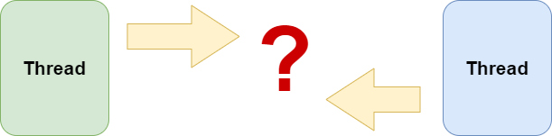
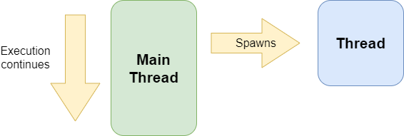
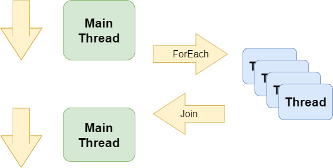
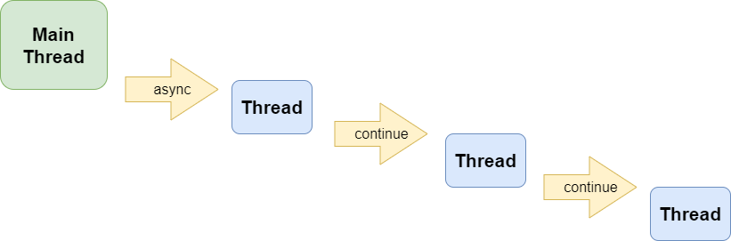
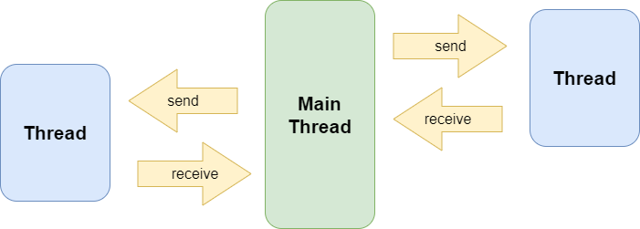
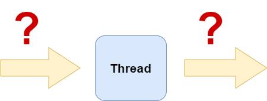
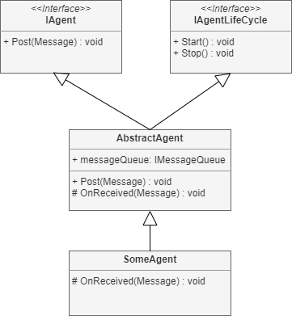
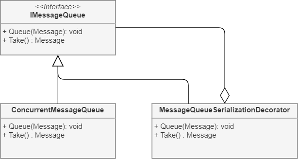
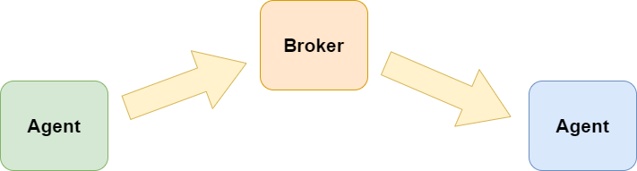
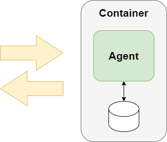

When it comes to concurrency my main axiom is: concurrency issues like race-conditions 
have to be avoided by design because detecting those via testing is pretty 
hard and actually close to impossible.

So how can we design the collaboration of concurrently executed parts of a software system in 
a way that classic concurrency issues are avoided?

<!--more-->
  
## Types of Concurrency

Before discussing how concurrently executed components could communicate with each other,
let's take a look at different types of concurrency and the particular needs for collaboration
these might have.

### Fire & Forget



Imagine there is a task to be performed which takes longer and which does not produce 
a result relevant to the "main control flow" of the application. 

An example could be sending an e-mail to inform the users of the application about 
the availability of some result. If we assume that potential errors are handled by that 
component directly, this component would not produce any result relevant for the main thread.

In such a case the "main control flow" could just "fire" some concurrent task, e.g. 
spawn a thread, and "forget" about it immediately, so no collaboration across threads
would be needed.

### Parallel.ForEach



Another type of concurrency would be the parallel processing of some data without causing
side-effects. This means, the data can be split into independent chunks which can be processed
individually and the partial results of each chunk can finally be joined to get the
complete result.

An example could be the reading and parsing of a bunch of log files.

In such a case an "active collaboration" between the threads processing the individual
chunks is not needed. The "main thread" waits for all "worker threads" to complete and 
then joins the partial results.

### Asnyc/Await, Promise, Continuation



One nowadays quite popular approach of handling concurrency is 
[asnyc/await](https://en.wikipedia.org/wiki/Async/await) also known as 
[Promise](https://en.wikipedia.org/wiki/Futures_and_promises) or 
[continuation](https://en.wikipedia.org/wiki/Continuation).

Simply speaking, this means an asynchronous task is started and a function or delegate 
is passed which will be called after the asynchronous task has completed, to continue
the processing of the result of that task.

If such a continuation causes a side effect, e.g. the result of the task is written
to some database directly and assuming the database is thread-safe,
then no collaboration with the "main thread" would be necessary.

Otherwise, if the continuation needs to "return" the final result to the "main thread"
then some collaboration obviously would be needed.

### Background workers



Imaging a component being responsible to perform a particular, longer running task like rendering 
a high quality image or computing a particular metric for a given log file. 
Let's assume the initialization of such a component is expensive as well, so an application
may decide to keep multiple of such components or multiple instances of the same component 
active as "background workers" to maximize the thoughput.

If such components produce results which are again inputs for further processing in 
other components then active, bi-directional communication would be needed between 
multiple threads.

## How can threads communicate?



Assuming a system which uses such "background worker" components to process concurrent tasks,
how could these components communicate with each other?

From pure "static design" perspective one component could just call an API on another component
or a component could raise a .NET event some other component could consume. But as those 
components live in their own threads, such a design would mean that multiple threads could 
potential alter the state of a component at the same time. 

This would obviously cause any kind of concurrency issues (race conditions, data corruption)
unless we make those components thread-safe e.g. by protecting the mutable data of each component
with critical sections. 

But this will result in a design and an implementation which is not desired.
We would rather like to keep most of our code single threaded as this is simply 
the much easier programming model. 

So if passing references from one thread to another is not a good idea, how could threads
communicate and exchange data then?

Plain vanilla threads simply cannot communicate with each other without using some kind of 
shared data. As discussed, such a data structure should be dedicated for inter-thread
communication and has to be safe for being accessed from multiple threads.
Most programming frameworks already provide ready to use thread-safe data structures like
thread-safe container implementations. In .NET such containers can be found in the
```System.Collections.Concurrent``` namespace.

Additionally to a thread-safe data structures we usually also need some
"thread synchronization events" to communicate from a "producer thread" to a
"consumer thread" that new data has been added to this data structure.
In .NET examples of such events are 
the [ManualResetEvent](https://learn.microsoft.com/en-us/dotnet/api/system.threading.manualresetevent?view=net-6.0)
and the [AutoResetEvent](https://learn.microsoft.com/en-us/dotnet/api/system.threading.autoresetevent?view=net-6.0).

If we now combine a thread-safe data structure with such a thread synchronization event and
[FIFO](https://en.wikipedia.org/wiki/FIFO_(computing_and_electronics)) semantics,
we get a thread with a message queue as single communication API. 

Such a design exists in many software systems under names like "actors", "message pumps",
"mailbox processors" and "agents" and it provides an elegant way to add concurrency
to a software design without drastically increasing complexity.

## Agent Design 

A simple design approach to encapsulate the thread and the message queue is to provide
a base class which calls a method implemented by a derived class whenever a new message
arrives. 



The base class would also implement two interfaces. One interface which will only be used
by the infrastructure to life-cycle the agent and another interface used to send messages
to such an agent.

I would recommend to put the actual message queue implement behind some interface as
well so that it can later be replaced, e.g. by a persistent queue implementation or
that features like logging can be added easily when needed.

For the actual concurrency implementation I would recommend to not reserve a dedicated
thread per agent but rather use a thread pool or a task pool to process a received message to
avoid wasting operating system resources. As the message queue design ensures that 
only one message at the time is processed, it also ensures that only one thread at
the time is operating on the data of such an agent. This means, it doesn't
need to be always exactly the same thread processing the messages so it is safe 
and efficient to use a thread pool for such an agent implementation.

## Message Design



As already stated, agents only communicate through messages. A message is usually called
"event" if it informs about something already happened. A message is usually called 
"command" if it requests the agent to do something.

Besides the semantical meaning, messages always only consist of data and must not
contain any function pointers. In fact, messages should not contain any pointers or
references to any data structure at all which is accessible from other components. 
In other words, all data contained in a message have to be owned by that message which 
means this data is either exclusively created or explicitly copied for that 
particular message.

To ensure this concept of "pass by value" in a bigger code base it can be
helpful to serialize a message e.g. into JSON when it is put into the message queue 
and to deserialize it when it is taken from the queue by the agent. As this 
certainly impacts performance such a diagnostics feature should be implemented as a 
[decorator](https://youtu.be/e_-bf93vx10)
of the message queue which is only active in the development environment.
This way any violation to the "pass by value" concept would be detected early on.

## Are Agents really Bulletproof?

If the agent implementation follows the design rules described above, the code of the agent,
the data owned by the agent, the input and output communication is "bulletproof".

But there are still pitfalls.

In a pure agent based system those agents would only communicate with messages. As every 
practically useful system has to interact with the "outer world", there would be dedicated
agents "owning" these input ports from and the output ports to the outer world. To ensure
this ownership by design these agents would even create and initialize the communication 
to such external services or devices, e.g. an agent owning a database connection would
create this connection by itself and may not even share the connection string with
any other agent.

In reality agents often have dependencies, references to components or services passed to
the agent during construction. Such components and services either need to be thread-safe or
it has to be ensured during composition of the application that each dependency is owned
by a single agent, so no other agent uses the same dependency. Depending on the size of the
software system it might worth the effort to invent some static code checking rules which
ensure this ownership of dependencies.

## Direct messages or Publish/Subscribe?



When it comes to actually sending a message to an agent there are basically two 
communication patterns we could use:

1) *Direct messaging:* The sender either has a reference to the receiver agent or the agent system
   has some form of agent discovery, so that the sender can send a message to the receiver agent 
   directly.
2) *Publish/Subscribe:* This usually requires some kind of "broker", "bus" or "mediator".
   Agents being interested in some type of message would register to the broker. A sender
   would then send a message to the broker which would then deliver this message to
   all interested agents.

Each pattern has its own pros and cons. One decision criteria would certainly be the need for many-to-many communication. Another criteria could be how decoupled agents should be, means
how much knowledge an agent should have or needs to have about the topology of the
"agent network".

## Micro Services?



If an agent is designed and implemented such that

- it has no dependency (reference) to any other part of the system
- no other part of the system has any dependency (pointer or reference) to it
- it effectively only communicates via messages

then it would only be a small step to move this agent to a container - could be a process
or some "real" container technology - and so make it individually deployable.

Some may call this a "micro service" then ...

## Conclusion

As to my observation in object-oriented programming developers focus too much on calling APIs,
telling an object to do something or asking an object for an intermediate (synchronous) result.
This approach does not work well when we need to decouple "what gets done from when it gets done".

A message based design much better addresses this need but it also requires a different 
mental model. In a message based system communication is always asynchronous - messages have
no return values, instead a response message may arrive in some point of time.
This may sound quite complex initially but it actually leads to a much more decoupled design
and so eventually leads to less complexity over time.

Of course many other design tactics and patterns exist to ensure correctness of concurrent code.
Agents are so far still my favorite choice when it comes to concurrency which also requires
collaboration of concurrently executed components.

If you are looking for a concrete example how to implement such agents then check out 
this video:

<iframe width="560" height="315" src="https://www.youtube.com/embed/W8x0cQoABYk" 
   title="YouTube video player" frameborder="0"
   allow="accelerometer; autoplay; clipboard-write; encrypted-media; gyroscope; picture-in-picture" 
   allowfullscreen>
</iframe>

## Update 2022-10-18

If you wonder how such a system should scale then I have this answer for you:

<iframe width="560" height="315" src="https://www.youtube.com/embed/NvyCbHfm1s4"
   title="YouTube video player" frameborder="0"
   allow="accelerometer; autoplay; clipboard-write; encrypted-media; gyroscope; picture-in-picture"
   allowfullscreen>
</iframe>