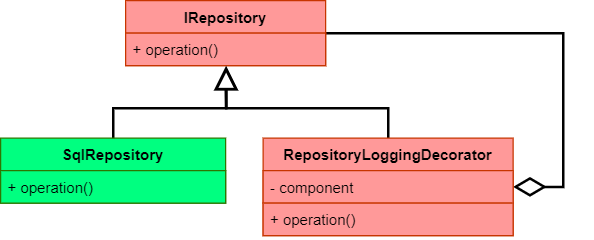

The decorator pattern is a powerful tool to apply "aspects" or cross cutting concerns such as 
logging or caching to a type without breaking the 
[Single Responsibility Principle](https://en.wikipedia.org/wiki/Single-responsibility_principle) (SRP).

But sometimes creating and maintaining decorators with bigger interfaces or a bigger number of 
decorated types becomes a problem. Dynamic proxies can be a solution to this.

<!--more-->

## What is a decorator?

Imaging we have an interface like this

```csharp
public interface IRepository 
{
   IReadOnlyCollection<Person> GetPersons();
   void Update(Person person);
   void Delete(Person person);
}
```

and an implementation which connects to a SQL database called ``SqlRepository``. 
Let's also imagine working directly with the database is too slow in some cases and 
therefore we want to add some in-memory caching.

We could add the cache directly in the ``SqlRepository`` but that would violate SRP and could 
result in a mess easily if we add more and more SQL as well as caching related code.

Instead we will create a "decorator" like this:

```csharp
public class RepositoryCachingDecorator : IRepository 
{
   private readonly IRepository myImpl;
   private readonly ICache myCache;

   public RepositoryCachingDecorator(IRepository impl, ICache cache)
   {
      myImpl = impl;
      myCache = cache;
   }

   public IReadOnlyCollection<Person> GetPersons()
   {
      if (myCache.Items.Count == 0)
      {
         myCache.Add(myImpl.GetPersons());
      }
      return myCache.Items;
   }

   public void Update(Person person)
   {
      myCache.Update(person);
      myImpl.Update(person);
   }
   
   public void Delete(Person person)
   {
      myCache.Delete(person);
      myImpl.Delete(person);
   }
}
```

Notice that the decorator "encapsulates" the actual ``IRepository`` implementation, returns the 
items from the cache once filled and updates cache and actual repository likewise.

Now we replace the creation of 

```csharp
var repository = new SqlRepository();
```

with

```csharp
var repository = new RepositoryCachingDecorator(new SqlRepository(), cache);
```

which activates caching for all users of ``IRepository`` without adding a single line of 
code to ``SqlRepository``.

For more details on how to implement such a caching decorator watch this video:

<iframe width="560" height="315" src="https://www.youtube.com/embed/e_-bf93vx10" 
  title="YouTube video player" frameborder="0"
  allow="accelerometer; autoplay; clipboard-write; encrypted-media; gyroscope; picture-in-picture" allowfullscreen>
</iframe>

This aspect of adding functionality without modifying existing types alone already makes the decorator
pattern powerful. But there is more.
Due to the way how decorators are constructed, we can compose multiple decorators 
and so add more and more functionality to a type without modifying it.
For example, consider decorators adding logging and locking to the ``SqlRepository``

```csharp
var repository = new RepositoryCachingDecorator(
   new RepositoryLockingDecorator(
      new RepositoryLoggingDecorator(
         new SqlRepository())), cache);
```


## Dynamic decorators

The downside of the decorator pattern is that we have to implement the complete 
interface. This can become cumbersome if we want to decorate many different interfaces 
with the same aspect or the interfaces to decorate have a lot of Apis.

In such cases "dynamic proxies" can be a solution.
In .NET we can use the [DispatchProxy](https://learn.microsoft.com/en-us/dotnet/api/system.reflection.dispatchproxy?view=net-6.0)
class to implement such a dynamic proxy based decorator.

A decorator adding locking to an ``IRepository`` based on ```DispatchProxy``` could look like this: 

```csharp
public class RepositoryLockingDecorator : DispatchProxy
{
   private IRepository myImpl;
   private object myLock;

   public static IRepository Create(IRepository impl)
   {
      var proxy = Create<IRepository, RepositoryLockingDecorator>();
      (RepositoryLockingDecorator)proxy).myImpl = impl;
      return proxy;
   }

   protected override object Invoke(MethodInfo targetMethod, object[] args)
   {
      lock(myLock)
      {
         return targetMethod.Invoke(myImpl, args);
      }
   }
}


var repository = RepositoryLockingDecorator.Create(new SqlRepository());
```

As the CLR routes every call to any Api of ``IRepository`` to the ``Invoke`` method, we have
to implement the actual aspect - the locking - only once. With this approach, the size of 
``IRepository`` is not relevant and we also do not have to adapt our decorator every time 
``IRepository`` gets changed. Furthermore we could make the decorator generic and so enable it
to decorate any interface.

The downside of this approach is that, as it is based on reflection, it probably reduces
performance a bit.

## Conclusion

Whether manually or dynamically created, decorators are a powerful tool and should definitively
considered more often when adding additional aspects to existing types. Dynamic proxies can
be an approach to reduce the maintenance of such decorators.


